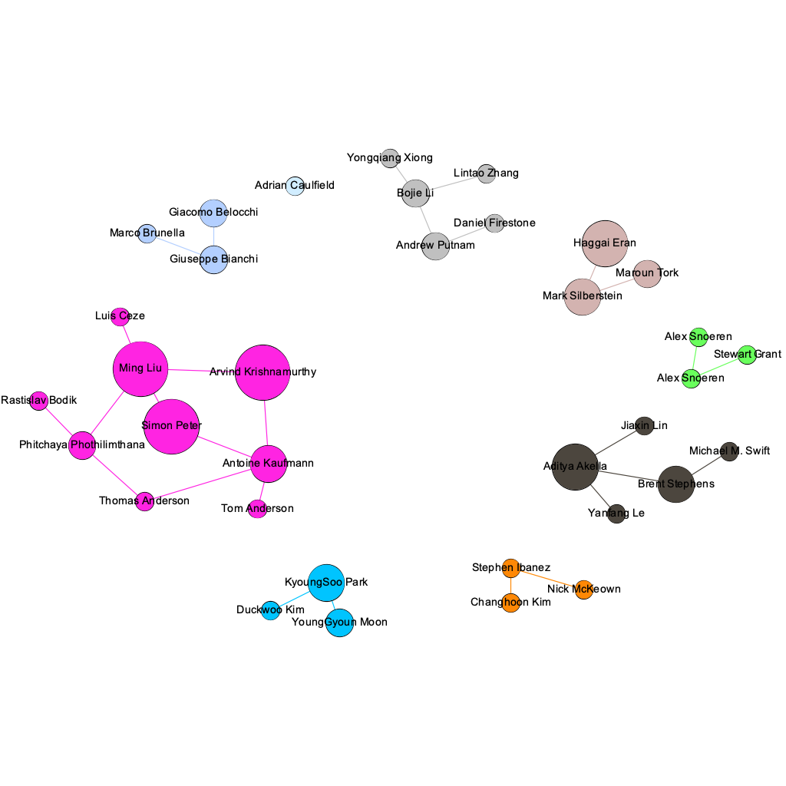

## Awesome SmartNIC

### Papers

- FlexTOE: Flexible TCP Offload with Fine-Grained Parallelism. *Rajath Shashidhara, et.al.* NSDI, 2022 [[Paper]](https://www.usenix.org/conference/nsdi22/presentation/shashidhara) [[Code]](https://github.com/tcp-acceleration-service/FlexTOE)
- LineFS: Efficient SmartNIC Offload of a Distributed File System with Pipeline Parallelism. *Jongyul Kim, et.al.* SOSP, 2021 [[Paper]](https://dl.acm.org/doi/pdf/10.1145/3477132.3483565) 
- Automated SmartNIC Offloading Insights for Network Functions.*Yiming Qiu, et.al.* SOSP, 2021 [[Paper]](https://dl.acm.org/doi/pdf/10.1145/3477132.3483583)
- Xenic: SmartNIC-Accelerated Distributed Transactions. *Jongyul Kim, et.al.* SOSP, 2021 [[Paper]](https://dl.acm.org/doi/pdf/10.1145/3477132.3483555)

* The nanoPU: A Nanosecond Network Stack for Datacenters. *Stephen Ibanez, et.al*. OSDI, 2021 [[Paper]](https://www.usenix.org/conference/osdi21/presentation/ibanez) [[Slide]](https://www.usenix.org/conference/osdi21/presentation/ibanez)
* Autonomous NIC offload. *Boris Pismenny, et.al.* ASPLOS, 2021 [[Paper]](https://dl.acm.org/doi/10.1145/3445814.3446732?cid=81461648878)
* The Programmable Data Plane: Abstractions, Architectures, Algorithms, and Applications. *Oliver Michel, et.al.* ACM Computing Surveys, 2021 [[Paper](https://dl.acm.org/doi/10.1145/3447868)]
* hXDP: Efficient Software Packet Processing on FPGA NICs. *Marco Spaziani Brunella, et.al.* OSDI, 2020 [[Paper]](https://www.usenix.org/conference/osdi20/presentation/brunella) [[Slide]](https://www.usenix.org/conference/osdi20/presentation/brunella) [[Code]](https://github.com/axbryd/hXDP-Artifacts)
* PANIC: A High-Performance Programmable NIC for Multi-tenant Networks. *Jiaxin Lin, et. al.* OSDI, 2020 [[Paper]](https://www.usenix.org/conference/osdi20/presentation/lin) [[Slide]](https://www.usenix.org/conference/osdi20/presentation/lin) [[Code]](https://bitbucket.org/uw-madison-networking-research/panic_osdi20_artifact/src/master/)
* Clara: Performance Clarity for SmartNIC Offloading. *Yiming Qiu, et.al.* HotNets, 2020 [[Paper](https://mgliu.sites.cs.wisc.edu/papers/Clara-hotnets20.pdf)]
* SmartNIC Performance Isolation with FairNIC: Programmable Networking for the Cloud. *Stewart Grant, et.al.* SIGCOMM, 2020 [[Paper]](http://cseweb.ucsd.edu/~snoeren/papers/fairnic-sigcomm20.pdf)
* A Case for SmartNIC-accelerated Private Communication. *Duckwoo Kim, et.al*. APNet, 2020 [[Paper]](https://dl.acm.org/doi/10.1145/3411029.3411034)
* Corundum: An Open-Source 100-Gbps NIC. *Alex Forencich, et.al.* FCCM, 2020 [[Paper]](http://cseweb.ucsd.edu/~snoeren/papers/corundum-fccm20.pdf) [[Slide]](https://www.fccm.org/past/2020/forums/topic/corundum-an-open-source-100-gbps-nic/) [[Code]](https://github.com/corundum/corundum)
* Lynx: A SmartNIC-driven Accelerator-centric Architecture for Network Servers. *Maroun  Tork, et.al.* ASPLOS, 2020  [[Paper]](https://marksilberstein.com/wp-content/uploads/2020/02/lynx_asplos20.pdf) [[Slide]](https://marksilberstein.com/wp-content/uploads/2020/02/1105-Lynx-final.pdf) [[Code]](https://github.com/acsl-technion/lynx)
* LeapIO: Efficient and Portable Virtual NVMe Storage on ARM SoCs. *Huaicheng Li, et.al.* ASPLOS, 2020 [[Paper]](https://www.microsoft.com/en-us/research/uploads/prod/2020/01/LeapIO-ASPLOS20.pdf)
* AccelTCP: Accelerating Network Applications with Stateful TCP Offloading. *YoungGyoun Moon, et.al.* NSDI, 2020 [[Paper](https://www.usenix.org/system/files/nsdi20-paper-moon.pdf)]
* iPipe: A Framework for Building Distributed Applications on SmartNICs. *Ming Liu, et.al.* SIGCOMM, 2019 [[Paper]](https://homes.cs.washington.edu/~arvind/[Paper]s/ipipe.pdf) [[Slide]](http://conferences.sigcomm.org/sigcomm/2019/files/slides/paper_7_3.pptx)
* E3: Energy-Efficient Microservices on SmartNIC-Accelerated Servers. *Ming Liu, et.al.* USENIX ATC, 2019 [[Paper]](https://www.usenix.org/conference/atc19/presentation/liu-ming)
* NICA: An Infrastructure for Inline Acceleration of Network Applications.  *Haggai Eran, et.al.* USENIX ATC, 2019 [[Paper]](https://www.usenix.org/conference/atc19/presentation/eran) [[Code]](https://github.com/acsl-technion/nica)
* UniSec: a unified security framework with SmartNIC acceleration in public cloud. *Jinli Yan, et.al.* TURC, 2019
* Loom: Flexible and Efficient NIC Packet Scheduling.  *Brent Stephens, et.al.* NSDI, 2019 [[Paper]](https://www.usenix.org/conference/nsdi19/presentation/stephens)
* Floem: A Programming System for NIC-Accelerated Network Applications. *Phitchaya Mangpo Phothilimthana, et.al.* OSDI, 2018 [[Paper]](https://www.usenix.org/conference/osdi18/presentation/phothilimthana) [[Slide]](https://www.usenix.org/sites/default/files/conference/protected-files/osdi18_slides_phothilimthana.pdf) 
* Your Programmable NIC Should be a Programmable Switch. *Brent Stephens, et.al.* HotNets, 2018 [[Paper]](https://www.cs.uic.edu/~brents/docs/panic.hotnets18.pdf) 
* Accelerating Flow Processing Middleboxes with Programmable NICs. *YoungGyoun Moon, et.al.* ACM APSys, 2018 [[Paper](https://dl.acm.org/doi/pdf/10.1145/3265723.3265744)]
* Towards Converged SmartNIC Architecture for Bare Metal and Public Clouds at Tencent Scale. *Layong Luo*. APNet, 2018 [[Slide]](https://conferences.sigcomm.org/events/apnet2018/slides/larry.pdf)
* Beyond SmartNICs: Towards a Fully Programmable Cloud (Invited Paper). *Adrian Caulfield, et.al.* HPSR, 2018 [[Paper]](https://ieeexplore.ieee.org/document/8850757/)
* Azure Accelerated Networking: SmartNICs in the Public Cloud. *Daniel Firestone, et.al.* NSDI, 2018 [[Paper]](https://www.usenix.org/conference/nsdi18/presentation/firestone)
* UNO: unifying host and smart NIC offload for flexible packet processing.  *Yanfang  Le, et.al.* SoCC 2017 [[Paper]](https://dl.acm.org/doi/abs/10.1145/3127479.3132252)  
* KV-Direct: High-Performance In-Memory Key-Value Store with Programmable NIC. *Bojie Li, et.al.* SOSP, 2017 [[Paper]](https://www.microsoft.com/en-us/research/publication/kv-direct-high-performance-memory-key-value-store-programmable-nic/) 
* IncBricks: Toward InNetwork Computation with an In-Network Cache. *Ming Liu, et.al.* ASPLOS, 2017 [[Paper](https://mgliu.sites.cs.wisc.edu/papers/IncBricks-asplos17.pdf)]
* ClickNP: Highly Flexible and High Performance Network Processing with Reconfigurable Hardware. *Bojie Li, et.al.* SIGCOMM, 2016 [[Paper](https://dl.acm.org/doi/pdf/10.1145/2934872.2934897)]
* High Performance Packet Processing with FlexNIC. *Antoine Kaufmann, et.al.* ASPLOS, 2016 [[Paper](https://people.mpi-sws.org/~antoinek/documents/16asplos_flexnic.pdf)] [[Slide](https://people.mpi-sws.org/~antoinek/documents/16asplos_flexnic_slides.pdf)]
* FlexNIC: Rethinking Network DMA. *Antoine Kaufmann, et.al.* HotOS, 2015 [[Paper](https://people.mpi-sws.org/~antoinek/documents/15hotos_flexnic.pdf)] [[Slide](https://people.mpi-sws.org/~antoinek/documents/15hotos_flexnic_slides.pdf)]
* Security Offload Using the SmartNIC, A Programmable 10 Gbps Ethernet NIC. *Gerald Sabin, et.al.* NAECON, 2015 [[Paper](https://ieeexplore.ieee.org/stamp/stamp.jsp?tp=&arnumber=7443082)]

### Reports

* Performance Characteristics of the BlueField-2 SmartNIC. *Jianshen Liu, et.al.* Preprint, 2021[[Paper](https://arxiv.org/abs/2105.06619)]

* Investigating Scientific Workload Acceleration using BlueField SmartNICs. *Brody Williams, et.al.* OSTI.GOV/Technical Report, 2020 [[Report](https://doi.org/10.2172/1607904)]

* Exploring Mellanox Bluefield SmartNICs as Accelerators for Heterogeneous Architectures.  *Brody Williams, et.al.* OSTI.GOV/Technical Report, 2019 [[Report](https://doi.org/10.2172/1565824)]

* Fungible Ups Data-Center Efficiency. *Bob Wheeler*, The Linley Group, 2020

* Mellanox Right-Sizes Smart-NIC SoC.  *Bob Wheeler*, The Linley Group, 2019

* Pensando, Xilinx Debut Smart NICs.  *Bob Wheeler*, The Linley Group, 2020

* How to Design SmartNICs Using FPGAs to Increase Server Compute Capacity. Achronix, 2019 [[Website]](https://www.achronix.com/sites/default/files/docs/How_to_Design_SmartNICs_Using_FPGAs_to_Increase_Server_Compute_Capacity_WP017.pdf)

### Projects

* OpenSNAPI: Toward a Unified API for SmartNICs [[Website]](https://www.ucfconsortium.org/projects/opensnapi/) [[Report](https://doi.org/10.2172/1645063)]
* OpenNIC: An FPGA-based NIC platform for the open source community. *Xilinx*. [[Website](https://github.com/Xilinx/open-nic)] [Related Projects: [open-nic-shell](https://github.com/Xilinx/open-nic-shell), [driver](https://github.com/Xilinx/open-nic-driver)] [[Video](https://www.bilibili.com/video/BV1V64y1m7g3)]

### Blogs

* What Is a SmartNIC?  *Kevin Deierling*, Mellanox Blog, 2018 [[Website ]](https://blog.mellanox.com/2018/08/defining-smartnic/)

* The new life of SmartNICs. *Mark Silberstein*, ACM SIGARCH, 2018 [[Website]](https://www.sigarch.org/the-new-life-of-smartnics/)

* 如何评价微软在数据中心使用 FPGA 代替传统 CPU 的做法？*李博杰*，知乎 [[Website]](https://www.zhihu.com/question/24174597/answer/138717507) 

* SmartNIC那些事. 唐杰账号（微信公众号）[Websit [1](https://mp.weixin.qq.com/s/jg0VVDrwn_hGb9G43Z_l7g), [2](https://mp.weixin.qq.com/s/q2620UtrmgvryTnLPH0Hbg), [3](https://mp.weixin.qq.com/s/os-ehp_uaDk3Z2-D4BCsMg), [4](https://mp.weixin.qq.com/s/xCQSG6c6LrCt-nwPjeDOvw), [5](https://mp.weixin.qq.com/s/QcHCv-RUvNB24GDXIcvrXw), [6](https://mp.weixin.qq.com/s/p5JbP8JKAiULE8BF_YCfNA), [7](https://mp.weixin.qq.com/s/EAB-fc9ZZwpki6A6M5sjlQ), [8](https://mp.weixin.qq.com/s/fjV3e4-q4Nk-a_uNRoaHFA), [9](https://mp.weixin.qq.com/s/T-ZY6N22p18w-qsPmT7srQ), [10](https://mp.weixin.qq.com/s/fo2s3BJ4a_93sK-wpW5S8w)] [[Video](https://v.youku.com/v_show/id_XNDYyNTEzMTg5Mg==.html)]

* SmartNICs and SmartSSDs, the Future of Smart Acceleration, *Scott Schweitzer*, SNIA SDC, 2020 [[Website&Slide](https://www.snia.org/educational-library/smartnics-and-smartssds-future-smart-acceleration-2020)]

* Have SmartNIC – Will Compute,  *Scott Schweitzer*, ElectronicDesign, 2020-2021[[Website](https://www.electronicdesign.com/industrial-automation/whitepaper/21134485/xilinx-have-smartnic-will-compute)]

* <https://wiki.libvirt.org/page/Virtio> 

### Patents

* REMOTE SMART NIC - BASED SERVICE ACCELERATION. *US Patent.* *US 20200278892A1* 

### Researcher

