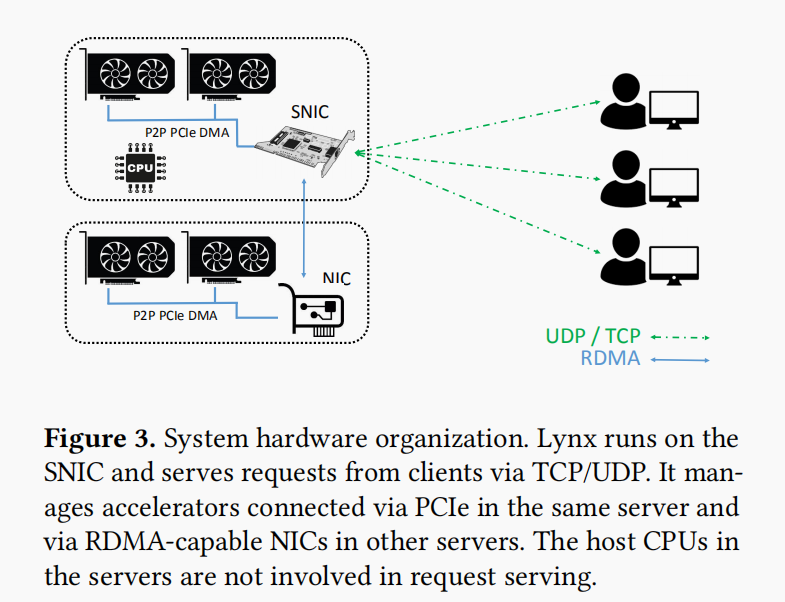
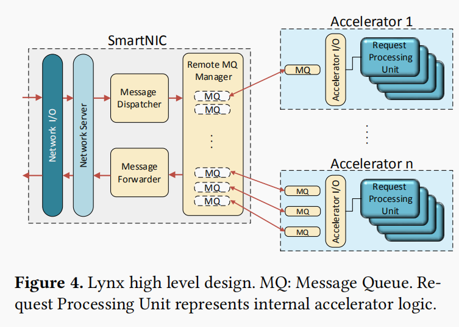

# Summary of Lynx: A SmartNIC-driven Accelerator-centric Architecture for Network Servers

Maroun Tork，Lina Maudlej，Mark Silberstein of Technion – Israel Institute of Technology Haifa, Israel

## Problem and Motivation
Lynx is build upon the concepts of GPU-centric server design which has several disadvantages. First, GPU is not good at executing control-intensive logic. Second, accelerator-side complex I/O layers put additional pressure on hardware resources. Third, most work require IB transport to connect to the service running on the GPU. Lynx eliminates these disadvantages by offloading most of the network communication logic to the SNIC and freeing both the CPU and the Accelerator for more suitable tasks .

## Hypothesis
Lynx is a solution which is an accelerator-centric network server architecture. It's design is based on the use of SNIC which is able to  execute generic server data and control planes by enabling network I/O from and to accelerators without using the host CPU for network processing and without running the network stack on acceleators.

The important hypothesis this work is based on is offload the network server logic to an SNIC. Also,it use SNIC RDMA for portability and scalability.

## Solution Overview

As Figure3 shows, the SNIC communicates with remote accelerators via RDMA using NICs loacted in their respective machines. Devices in the same machine communicate via PCIe peer-to-peer DMA.

Lynx's design strives to meet four requirements: **Provide accelerator-side network I/O**, **Avoid running generic server and dispatching logic on accelerators**, **Offload accelerator I/O layer to SNIC**, **Maintain portability across accelerators**.

Lynx can be departed into two parts: SmartNIC and accelerators. In the accelerator end, Lynx provides network I/O API directly from the accelerator-resident code so that the accelerator can receive and send data. At the same time, Lynx avoid running generic server and dispatching logic on accelerators. In the SmartNIC end, network processing and accelerator management tasks are done by running generic and  application-agnostic code. Also, the SNIC does not run accelerator-specific code.

Network Server:  
performs TCP/UDP transport layer processing, listens on the network ports requested by the server developer, and forwards messages from the network to accelerators and back.

Message Dispatcher:  
dispatches received messages to appropriate message queues according to the dispatching policy.

Message Forwarder:    
fetches the outgoing messages from the message queues, and sends them to respective destinations.

Remote Message Queue Manager:  
 is a key to maintaining the mqueues in accelerator memory. It runs on the SNIC, and uses one-sided RDMA to access the mqueues in the accelerator which makes it  accelerator-agnostic.

Message Queues(MQ):  
is used for passing messages between the accelerator and the SNIC. Mqueues and their status registers are located in accelerators’ local memory.

## Limitations and Possible Improvements

1.  Lynx advocates for GPU-centric server architecture, but improves efficiency by offloading much of the server logic from GPU to SNIC. But, how do we decide which logic is suitable for offloading? Also, whether we can offload more server logic to SNIC than Lynx?

2.  Lynx focuses on  application-level acceleration on GPUs, while not on packet processing like others. Can packet processing be added to Lynx?

3.  ……

## Some Discussions
1.  What is the function of accelerator in Lynx?  
    Data usually is transferred from CPU to accelerator, however, data is transferred from SNIC to accelerator directly without CPU utilization in Lynx. Lynx uses GPUDirectRDMA.

2. Why SNIC?  
   PCI has rated power consumption which is not all used up which can consumed by SNIC.

3. Why can't we use SNIC as another CPU?  
   SNIC has different characteristics and resources from CPU. So, SNIC can not be used as an added core simply.
