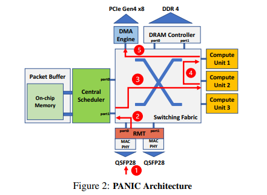
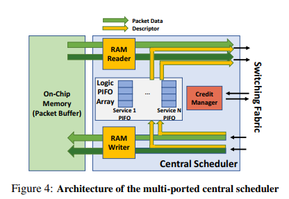
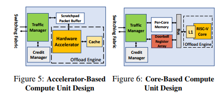
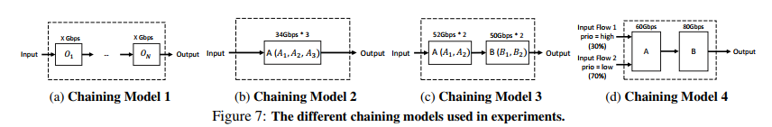
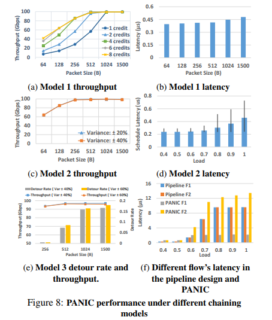
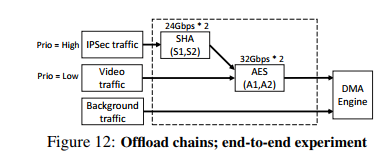
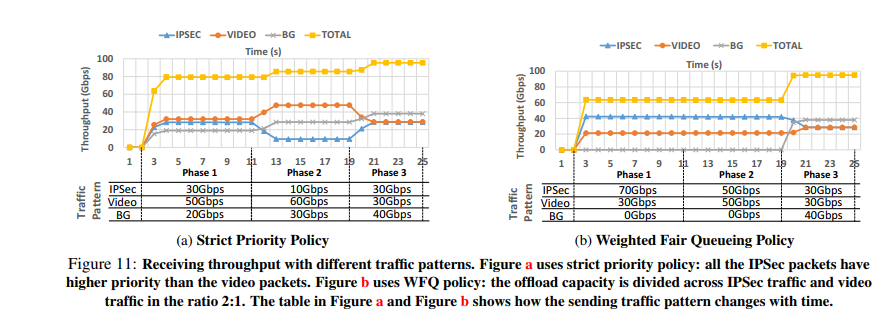

# PANIC:A High-Performance Programmable NIC for Multi-tenant Networks 

Jiaxin Lin, University of Wisconsin - Madison; Kiran Patel and Brent E. Stephens, University of Illinois at Chicago; Anirudh Sivaraman, New York University (NYU); Aditya Akella, University of Wisconsin - Madison  

## Motivation and Problem

网络的线速度与cpu的使用和生成数据的速度之间的差距正在迅速扩大。新兴的smart nic 有助于该问题的解决。许多不同的云和数据中心应用都将计算任务offload到SmartNic，以此得到性能的提升。然而目前没有一种类似“银弹”的offload 适用所有情景来提高性能。

------以上为动机------

现有的NIC不能在支持大量不同的卸载的同时确保高吞吐量、低延迟、多用户之间数据隔离、灵活的卸载链、以及对性能可变的卸载要求。

------以上为问题------

## Solution

作者提出了一种“新”的smartnic框架，结合了pipeline类型smartnic的高速，manycore类型的灵活。解决前述现有nic的几个问题。

##### Offload Variety:

该框架下的每个卸载单元（FPGA,Manycore）都是独立连接到high-performance interconnect，同时RMT pipeline（硬件实现） 根据卸载需求生成数据包头，从而不需要其他的路由或数据处理。以此来实现多种类型的卸载的同时保证高性能。

##### Dynamic Offload Chaining  

RMT pipeline 模块可以根据接收数据包的要求将新的卸载链编程到查找表中。即RMT pipeline 的lookup tables 是可编程的。

##### Policies for Dynamic Multi-Tenant Isolation  

多租户隔离主要有调度模块实现，调度模块有独立的buffer，并根据数据包的优先级进行数据包的调度，可以对相同服务的数据进行并行卸载，实现多租户之间的数据隔离。

##### Support for offloads with variable and below line-rate performance  

数据调度中心可以支持不同性能的卸载，对于要求低速的卸载服务，可以通过PANIC框架的混合推拉调度策略（hybrid push/pull ）借助buffer实现。

##### High Performance  

PANIC使用了类似crossbar 的non-blocking 高等分拓扑结构，即链中每个卸载通过再on-chip网络以线速度收发。

##### PANIC 框架

如上图PANIC主要分为四个部分：

**RMT Pipeline**：对接收的数据进行分析，根据match-action tables 进行响应的处理，生成descriptor。

**High Performance Interconnect**：PANIC utilizes a non-blocking, low latency, and high throughput crossbar interconnect network, which, for the scale of our design, still has a low area and power overhead.  

**Centralized Scheduler**：中心调度模块采用Hybrid Push/Pull  调度策略，在负载高时采用pull-based 以保证有效的负载平衡和数据包调度，在负载低时采用push-based来保证低延迟。同时通过credit manager模块来监控卸载单元的忙碌情况。

**Compute Unit** ：作者实现了两种计算单元（卸载单元），一种基于硬件卸载的，一种基于多核卸载。分别应用在不同的卸载任务中。

数据流：

step1：接收到数据包先经RMT解析包头并匹配合适的卸载链并生成PANIC descriptor

step2：packet进入switch，若不需要卸载直接传到DMA，若需要卸载传入调度中心的buffer。

step3：调度中心根据调度策略进行调度将packet调入空闲的offload单元。

step4：数据经过卸载单元处理后直接通过DMA传输到host。

### result

作者讨论了ASIC实现的可行性，同时基于FPGA原型实现了PANIC框架并进行一系列实验。

如上图，先是进行了四种模式的卸载链进行实验，实验结果如下图，均能达到100G的带宽，也给出了不同包大小的延时情况。

同时也进行了端到端的卸载实验，对SHA-3-512 和AES-256   两个卸载进行实验。

### Limitations and Possible Improvements

### Impact and What can be Learned from

1.这篇文章对我们smartnic的仿真工作比较有帮助，可以在其基础上进行仿真工作。

### Discussion

1.双端口为什么就可以达到256G的速度？

答：

FPGA-based Crossbar: We have implemented an 8 * 8 fully connected crossbar in our FPGA prototype. The frequency
for this crossbar is 250 MHz, and the data width is 512 bits. This leads to a per-port throughput of 128 Gbps

Crossbar（即CrossPoint）被称为交叉开关矩阵或纵横式交换矩阵。基于总线结构的交换机一般分为共享总线和共享内存型总线两大类。

2.Switching Fabric是论文的贡献吗？
3.Compute Unit 是论文的贡献吗？
4.作者实现了几种Compute Unit，Accelerator-Based的卸载单元具体实现哪种？

答：

作者在论文中实现了Accelerator-Based和Core-Based Compute Unit
其中Accelerator-Based 实现了两个类型: AES-256-CTR encryption engine 和 SHA-3-512 hash engine。
Core-Based ：We have also implemented a RISC-V core engine based on the open-source CPU core generator

5.开源的代码实现了什么？

答：

开源代码是FPGA代码，即通过FPGA实现该框架的代码，还有一些实验的代码。即复现文章实验的代码。

6.RISC-V的核心是用FPGA实现的吗？

答：

RISC-V不是基于FPGA，是基于一个开源的cpu核，
原文：We have also implemented a RISC-V core engine based on the open-source CPU core generator.https://spinalhdl.github.io/SpinalDoc-RTD/SpinalHDL/Libraries/vexriscv.html

7.Compute Unit的支持有上限吗？可以是多个吗？更或者说，Compute Unit是根据应用场景按需生成的？

答：

文章中没有明确指出compute unit的限制，但是计算单元需要和纵横式交换矩阵相连（实际上就是直接通过线相连），若太多计算单元的话（特别是manycore的接线要求）走线会变得很复杂难以实现。
同时也有提到他们的PANIC可以在不同的拓扑之间进行选择，无需更改其他设计。但是超过一定规模就会延时高。

原文：
Fortunately, with PANIC, we are able to choose between different interconnect topologies without having to change other parts of the design.
If there is a need to scale beyond the limits of a single crossbar, we can switch to a more scalable (but higher-latency) flattened butterfly topology